# Widget Designer

### Introduction

Widget Designer is a powerful online development environment that provides a feature-rich toolset to build complex applications with rich user interfaces. The development environment is based on AngularJS and can be extended with any third party services and front-end libraries. Using Widget Designer, you can create:

* * * custom widgets with complex workflows that meet your requirements. Once created and published, your custom widgets will be available in the palette for designing pages using Page Designer
    * any desired user interface to make widget setup more user-friendly using client technologies such as HTML, JavaScript and AngularJS
    * shared libraries that can be reused on multiple widgets

### 5 steps to make your widgets DAC publishable

1. Import and load the widget \(See section 2.1\)
2. Set up your widget properties in configuration.JS
3. Define the widget view in index.html and your style in index.css
4. Create a controller for your widget logic in Index.JS
5. Publish your widget

### Touring the Widget Catalog

The main components of the Widget Catalog are described here and this is where you will manage all your standard and custom widgets.

#### Getting Ready

All you will need for this recipe is the Decisyon App Composer \(DAC\) DevBox so that you can launch DAC and access the Widget Designer IDE to understand all the available features. As you open Widget Designer, the Catalog page is displayed. The next screenshot provides an overview of the Widget Designer Catalog.

* * * Folder Catalog
    * Widget List
    * Create Menu

####  How to do it…

Here we will take a look at how the following areas of the Widget Catalog can be used.

* * * Folder Catalog
    * Widget List
    * Create Menu

This screenshot shows the different types of objects that can be created using the Create Menu in the Widget Catalog. After selecting a widget type, you have to define the name of the widget. For all the objects created in the catalog, you can use the pop-up menu to copy, paste and rename the object as well as delete the selected object. You can also use drag & drop to move both the folders and widgets inside the catalog.

**Folder** - Folders can be created to group and organize widgets in the Widget Catalog.

* Custom Widget - Custom widgets are composed of:
  * Properties exposed by the widget
  * Template that describes the widget HTML markup
  * Scripts that describe the widget logic
  * Some assets such as external JavaScript libraries, CSS definitions, and/or images
  * AngularJS module declarations if the widget uses services or directives that are not built-in to the AngularJS framework
  * Resource dependency settings \(JS, CSS\)
* The following types of widgets can be created:
* Generic widget - Widget that has any type of user interface
* Data presentation widget – Widget data source consists of one or more Reports
* Data Connector - Data connector widget allows pushing data to a generic visualization widget
  * Shared library - Shared libraries are composed of:
  * JavaScript libraries, CSS definitions, template HTML, and/or images that you want to reuse on multiple widgets.
  * Resource dependency settings \(JS, CSS\)

### Touring the Widget Editor

It is a great idea to familiarize yourself with the main components of the Widget Editor, since that is where you will make building applications and rich user interfaces much easier.

Widget Editor has the following features:

* * * Editing and upload of JS and CSS resources
    * Code editor and content assist
    * Multiple perspectives
    * Preview
    * Resource dependencies settings \(JS, CSS\)
    * Ability to use any browser developer tools
    * Multiple resources association

#### Getting Ready

Once you on the Widget Catalog page, double-click on a widget in your Resource Catalog to open the Widget Editor. The next screenshot provides an overview of the Widget Editor.

* * * Widget Resources Catalog
    * Settings
    * Perspectives
    * Documentation

####  How to do it…

Here we will take a look at how the different areas of the Widget Editor can be used.

**Widget Resources Catalog**

The next screenshot shows the different resources in the Resources Catalog.

* Each widget has special resources that are automatically organized into special folders.
* A special folder can’t be deleted, moved or renamed
* A special resource can’t be deleted, moved or renamed

* Special resource: index.html
  * index.html resides at the root level.
  * index.html resource is the main view and contains HTML, CSS, and Angular elements.

* Special resource: configuration.json
  * configuration.json contains all generic configuration data to load parameters.
  * configuration.json will be used to specify the custom properties of the widget.
  * When you specify a new custom property and save the configuration.json file, the system automatically adds the property in Settings panel. When editing the widget, this allows you to easily modify the widget's property values.
  * The custom properties defined in the configuration.json will be available by using DECISYON.target.content.ctx object. The context object can be used in your code and in data binding expressions.
* Special resource: mockContext.json
  * mockContext.json contains all contextual information of the widget.
  * The context is a list of references to the business data manipulated by the process instance during its execution.
  * mockContext.json also contains all custom properties defined in the configuration.json and all supported properties.
  * The context data will be automatically assigned to the $scope and will be available by using DECISYON.target.content.ctx object. The context object can be used in your code and in data binding expressions.
  * mockData.json and mockContext.json help you to simulate the widget behavior.
* Special resource: mockData.json
  * The mockData.json contains data for scripts testing.
  * The data will be automatically assigned to the $scope and will be available by using DECISYON.target.content.data object. You can use it in your code and in data binding expressions.
  * When you associate a report data source in a Data Presentation widget, the system allows to you to automatically generate mock data. For each report associated with the widget, the system generates a specific node in the JSON. The first report has

_**reportProvider**_ as the main node, while the main node for all subsequent reports are named _**reportProvider\_n**_, where n is an unique sequential number starting with 1

* Special Folder: shared
  * The shared folder will contain the individual shared libraries that you want to reuse on multiple widgets.
  * The system will automatically resolve the imported shared libraries as dependencies before resolving the widget dependencies.

**Settings**

The next screenshot shows the different options in the Settings panel.

* Dependencies
  * Describe all scripts and css dependencies for each widget.
  * To do so, upload the resource that you want to use in widget resource catalog and add to your custom widget as an asset.
  * Use dependency properties in the Settings panel to add a resource as a dependency to the widget.

**Perspectives**

The next screenshot shows the different perspectives available in the Widget Editor.

**Documentation**

## Getting Started with Custom Widgets

This section provides an introduction on how to create custom widgets using Widget Designer

### Hello World Application

Let’s build a variation of the classic Hello World application using Widget Designer.

#### Getting Ready

All you will need for this recipe is the Widget Designer IDE and a basic understanding of AngularJS. Our Hello World application needs the following functionality:

1. Ability for the user to provide text input via an input field
2. When the user is typing in this input field, the UI should be updated automatically with the latest value from input field.

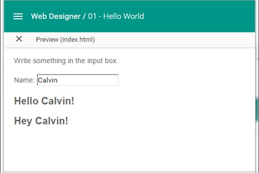

####  How to do it…

Here we will take a look at how to create the application using the Widget Catalog and Editor.

* In the Widget Catalog, create a new Generic widget
* Assign a unique logical name, for example “exHelloWorld”
* Double-click and open the widget in Widget Editor
* Define the widget view in index.html
* Define the widget style in index.css
* Publish the widget
* In the Page Designer, use the widget in a page

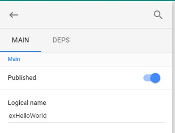

**Widget Structure**

* * * We have set the ng-model directive for the Textbox. We use ng-model="name" in the input field to data-bind the input with the model named as "name".
    * There are two HTML H1 elements. One is set with a template expression \(written with double curly braces and the model name within: {{name}}\), while other is specified with the ng-bind directive: ng-bind="name".
    * We have set the ng-show directive for the two HTML H1 to display the elements based on the given model value.
    * As we type in the Textbox, both the HTML H1 elements display the value of the Textbox dynamically.

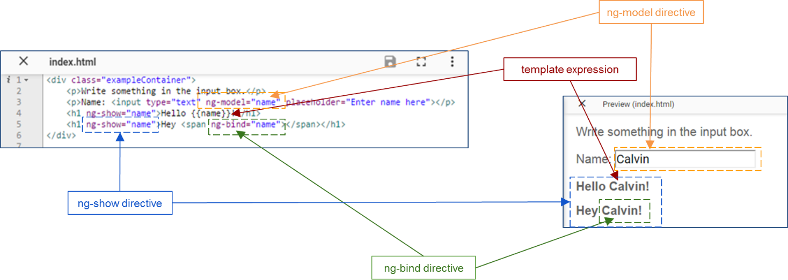

**Output**

**Use the Widget in Page Designer**

This screenshot shows how to use the widget in Page Designer to create a new page in DAC Runtime.

### Hello &lt;current\_user&gt; Application

Let’s build an application to display “_Hello current\_user_” using Widget Designer.

#### Getting Ready

All you will need for this recipe is the Widget Designer IDE and a basic understanding of AngularJS. Our Hello World application needs the following functionality:

1. Display “Hello current\_user!” for the current user
2. Translate the greeting based on the language defined in the user profile

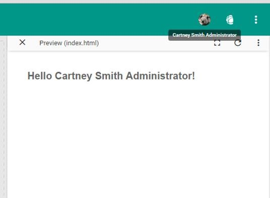

####  How to do it…

Here we will take a look at how to create the application using the Widget Catalog and Editor.

* In the Widget Catalog, create a new Generic widget
* Assign a unique logical name, for example “exHelloCurrentUser”
* Double-click and open the widget in Widget Editor
* Define the controller and the directive named “helloCurrentUser” in index.js
* Define the widget view in index.html
* Define the widget style in index.css
* Publish the widget
* In the Page Designer, use the widget in a page

**Widget Structure**

* * * Create a directive named “helloCurrentUser”, a controller to create the User model which can be used in our template.
    * We will use the following DAC APIs:
    * the service dcyService by injecting them in our controller function arguments
    * the filter dcyTranslate for translating the greeting
    * the method DECISYON.ng.register.directive to register a directive in DAC
    * the method DECISYON.ng.register.controller to register a controller in DAC

**Controller**

* * * Define a controller to create the User model which can be used in our template. The User information data is already available in $scope variable: $scope.DECISYON.userInfo.
    * Create and register the controller by DECISYON.ng.register.controller\(‘nameController’, ConstructorController\). The function passed is injected with the services that we need.
    * Use the Decisyon service dcyService to translate the label for the greeting in multiple languages.

**Directive**

* * * Define the directive "helloCurrentUser".
    * Create and register the directive using DECISYON.ng.register.directive\(‘nameDirective’, ConstructorDirective\).
    * The function passed returns a directive definition object which contains these following properties:
    * restrict: 'E' - this means that the directive will only work as an Element.
    * template - this specifies the HTML markup that will be produced when the directive is compiled and linked by Angular. This includes HTML, data binding expressions \({{ }}\), using the filter dcyTranslate.
    * controller - this defines the controller that will be associated with the directive template.
    * controllerAs - this defines the controller alias used in the controller code and in the view.
    * bindToController: true - this ensure that properties are bound to the controller instead of the scope. In combination with controllerAs, this lets us access the user variable as currUserCtrl.userInfo.fullname within the view.

**View**

* * * Define the view in index.html.
    * Use the CSS class defined in index.css \(resolved as a widget dependency\).
    * Use the directive helloCurrentUser as an element

**Output**

**Use the Widget in Page Designer**

This screenshot shows how to use the widget in Page Designer to create a new page in DAC Runtime.

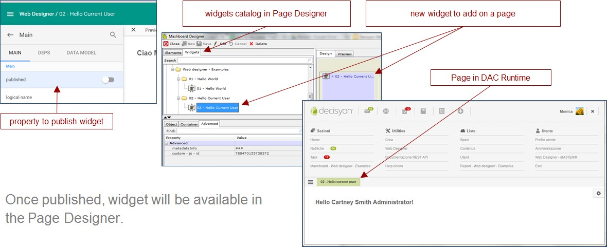

### Hello World Application using Custom Settings

Let’s build a variation of the first Hello World application \(in Section 2.1\) using custom properties and parameters.

#### Getting Ready

All you will need for this recipe is the Widget Designer IDE and a basic understanding of AngularJS. Our Hello World application needs the following functionality:

1. Ability for the user to provide text input via an input field
2. When the user is typing in this input field, the UI should be updated automatically with the latest value from input field.
3. Ability to control the border, background and text color using custom settings

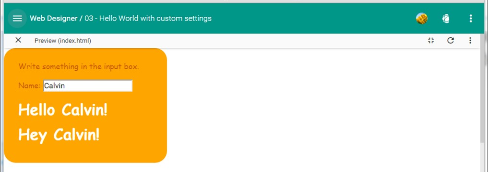

####  How to do it…

Here we will take a look at how to create the application using the Widget Catalog and Editor.

* In the Widget Catalog, create a new Generic widget
* Assign a unique logical name, for example “exHelloWorldWithCustomSettings”
* Double-click and open the widget in Widget Editor
* Define the custom properties in configuration.json
* Define the controller in index.js
* Define the widget view in index.html
* Define the widget style in index.css
* Publish the widget
* In the Page Designer, use the widget in a page

**Custom Settings**

* * * In configuration.json, define two custom properties in the JSON schema shown in the above image.
    * Use the prefix $ to refer to a custom group, a custom subgroup, a custom subset or a custom property.

* * * Define the first custom property named “theme” \($THEME\) that allows to change the widget content style.
    * This property is defined as a dropdown list and has two admissible values:
    * orange: rounded border, orange background, white text
    * green: border and text green

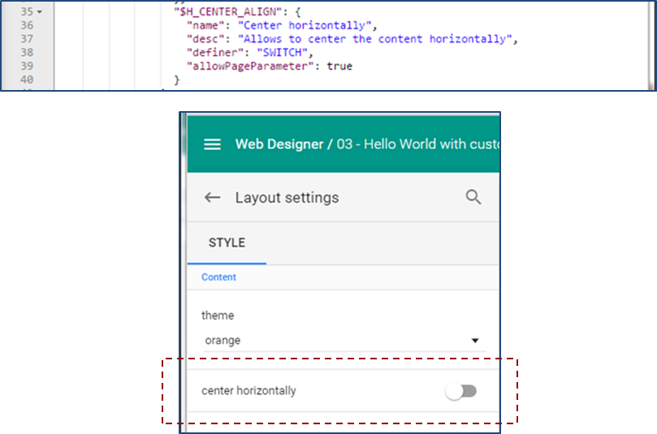

* * * Define the second custom property named "center horizontally" \($H\_CENTER\_ALIGN\) that allows to center the widget content horizontally.
    * This property is defined as a switch and its value accepts a parameter. The field

_allowPageParameter_ indicates that the value refers to a page parameter.

**Controller**

* * * Define a controller to create the model which can be later used in the template to binding our custom properties.
    * The custom properties data is already available in $scope variable:

$scope.DECISYON.target.content.ctx.

* * * Use $scope.DECISYON.target.content.ctx.&lt;property\_id&gt;.value to refer to our two custom properties in the code.
    * Use $watch to watch any changing in values on the scope DECISYON.target.content.ctx.

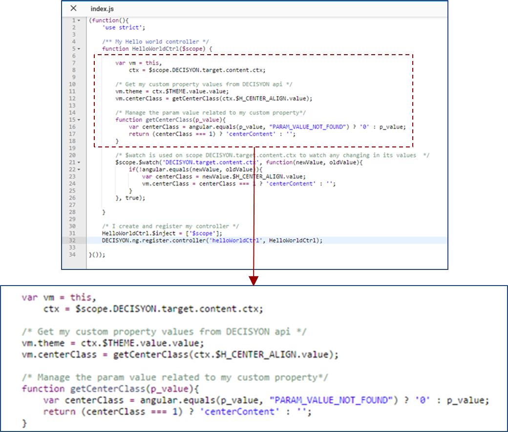

* * * To manage a parameter than is not assiged a value related to a custom property, check if that is equal to ‘PARAM\_VALUE\_NOT\_FOUND’

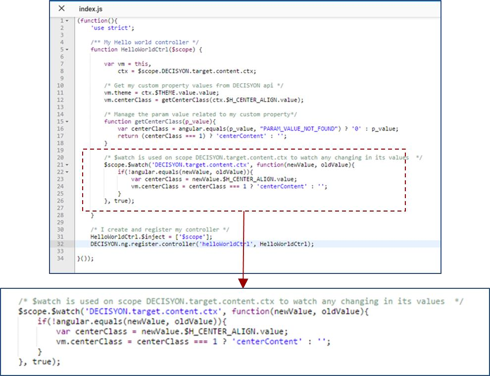

* * * To manage the changes of a parameter related to a custom property, use $scope.$watch\(\)

**View**

* * * Define the view in index.html.
    * Use the CSS class defined in index.css \(resolved as a widget dependency\).

* * * Use the ngClass directive allows to dynamically/conditionally add CSS classes to the HTML by databinding an expression that represents all classes to be added.
    * Write an expression for the ngClass directive using array syntax and checking both the scope variable theme and the scope variable centerClass.

**Output**

* * * Remember to reload the mockContent.json after the custom property value is changed.

**Use the Widget in Page Designer**

This screenshot shows how to use the widget in Page Designer to create a new page in DAC Runtime.

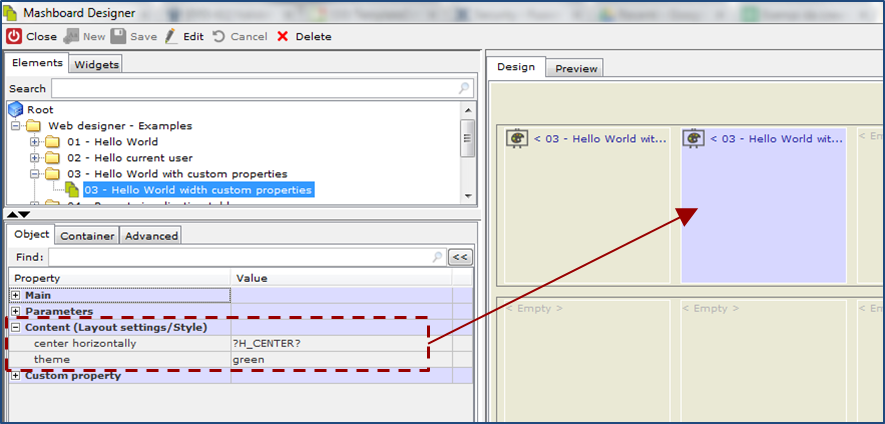

* In a new page in Page Designer, add two instances of the widget that was created in this example.
  * For the first widget, set the theme property to orange value.
  * For the second widget, set the theme property to green value.

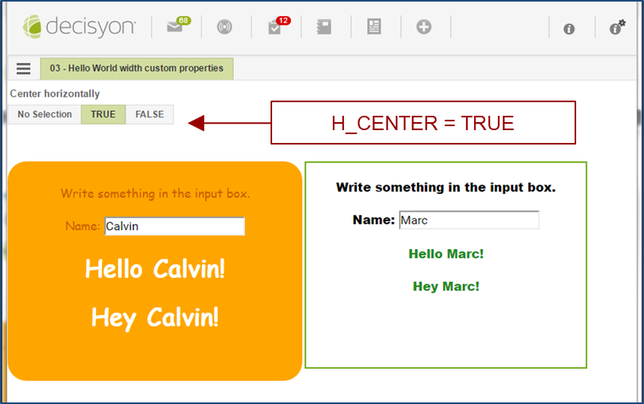

